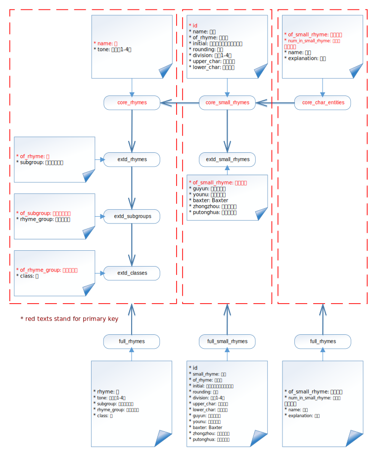

# _Guangyun_

_Guangyun_ (廣韻) SQLite database for Traditional Chinese Phonology

## Examples

* [廣韻的例外](https://sgalal.github.io/Guangyun/notebook/廣韻的例外.html)
* [廣韻音節表](https://sgalal.github.io/Guangyun/notebook/廣韻音節表.html)
* [廣韻反切上字表](https://sgalal.github.io/Guangyun/notebook/廣韻反切上字表.html)
* [廣韻四聲相配表](https://sgalal.github.io/Guangyun/notebook/廣韻四聲相配表.html)
* [廣韻反切系聯](https://sgalal.github.io/Guangyun/notebook/廣韻反切系聯.html)

## Usage

The database could be downloaded from [release page](https://github.com/sgalal/Guangyun/releases), or access the [web interface](https://github.com/sgalal/Guangyun).

**TODO FIXME: this image is not up to date.**

See [_Guangyun_](https://sgalal.github.io/Ghehlien/guangyun.html) for a detailed description.

## Featured Users

* [sgalal/Brogue](https://github.com/sgalal/Brogue): Chinese dialect generator based on the Middle Chinese phonological system

## Acknowledgements

* [YonhTenxMyangx](https://github.com/BYVoid/ytenx) - Source of _Guangyun_ data

## License

Code for building the data is distributed under MIT license.

Web pages are distributed under MIT license.

Codes from CodeMirror project (`docs/codemirror`) is distributed under MIT license.

Dictionary data follows the original license.
