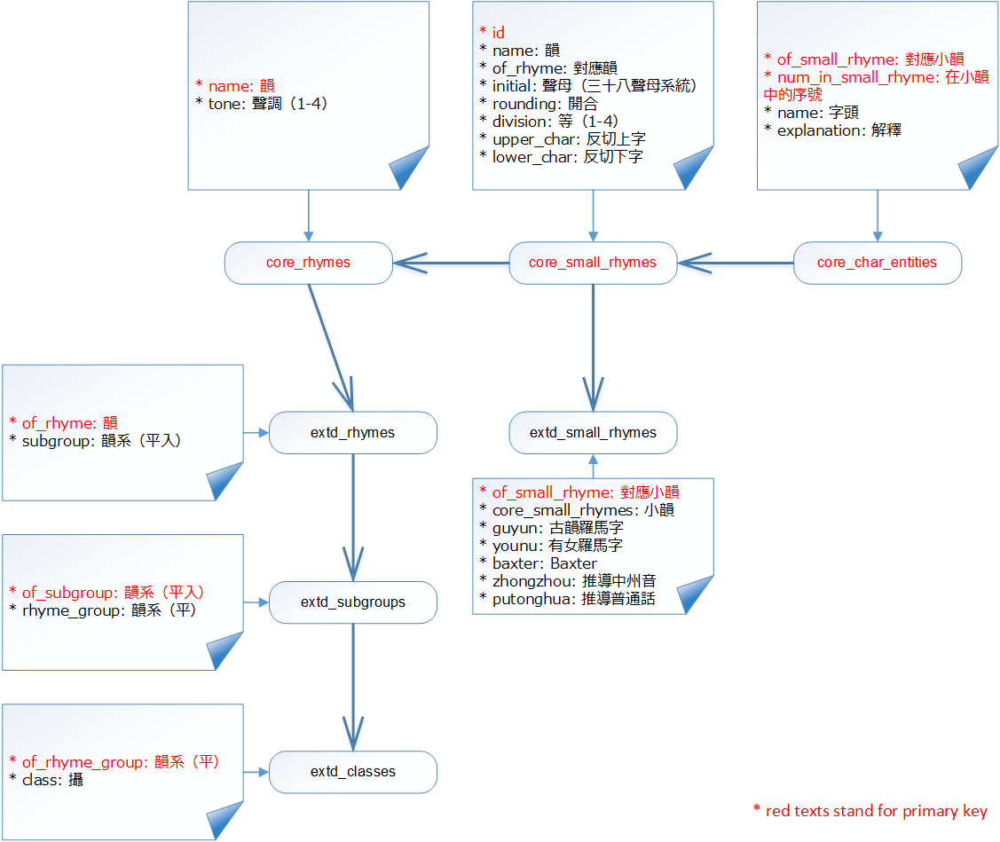

# _Guangyun_

_Guangyun_ (廣韻) SQLite database for Traditional Chinese Phonology

## Usage

The database could be downloaded from [release page](https://github.com/sgalal/Guangyun/releases).

See [_Guangyun_](https://sgalal.github.io/Ghehlien/guangyun.html) for a detailed description.

## Featured Users

* [sgalal/Ghehlien](https://github.com/sgalal/Ghehlien)
* [sgalal/brogue](https://github.com/sgalal/brogue)

## Acknowledgements

* [YonhTenxMyangx](https://github.com/BYVoid/ytenx) - Source of _Guangyun_ data

## License

Code for building the data is distributed under MIT license.

Dictionary data follows the original license.
