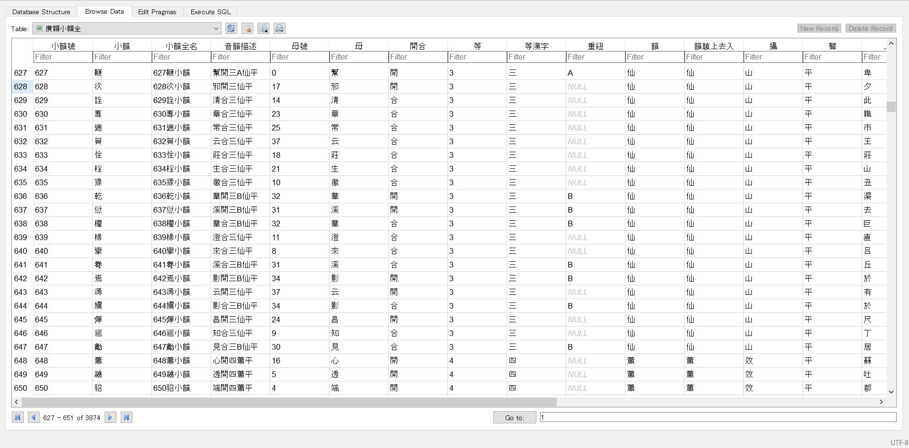

# qieyun-sqlite [](https://www.jsdelivr.com/package/npm/qieyun-sqlite)

《切韻》音系 SQLite 資料庫

姊妹項目：《切韻》音系 JavaScript 函式庫 \([sgalal/qieyun-js](https://github.com/sgalal/qieyun-js)\)。

## 用法

下載連結：<https://cdn.jsdelivr.net/npm/qieyun-sqlite@0.1.29/data.sqlite3> (1.56 MB)。

推薦使用 [DB Browser for SQLite](https://sqlitebrowser.org/) 開啓 [本資料庫](https://sgalal.github.io/qieyun-sqlite/data.sqlite3)。



## 表

### 廣韻小韻全

| 屬性 | 示例數據 1 | 示例數據 2 |
| -- | -- | -- |
| 小韻號 | 1 | 94 |
| 小韻 | 東 | 隓 |
| 小韻全名 | 1東小韻 | 94隓小韻 |
| 音韻描述 | 端開一東平 | 曉合三A支平 |
| 母號 | 4 | 35 |
| 母 | 端 | 曉 |
| 開合 | 開 | 合 |
| 等 | 1 | 3 |
| 等漢字 | 一 | 三 |
| 重紐 | _NULL_ | A |
| 韻 | 東 | 支 |
| 韻賅上去入 | 東 | 支 |
| 攝 | 通 | 止 |
| 聲 | 平 | 平 |
| 上字 | 德 | 許 |
| 下字 | 紅 | 規 |
| 反切 | 德紅切 | 許規切 |
| 古韻羅馬字 | tung | hjye |
| 有女羅馬字 | tung | xve |
| 白一平轉寫 | tuwng | xjwie |
| unt切韻朗讀音 | tuŋʷ˦ | hɥɛ˦ |
| 推導中州音 | tuŋ | hui |
| 推導普通話 | dong1 | hui1 |

### 廣韻字頭全

| 屬性 | 示例數據 1 | 示例數據 2 |
| -- | -- | -- |
| 字頭號 | 6 | 865 |
| 字頭 | 倲 | 睢 |
| 小韻號 | 1 | 94 |
| 小韻 | 東 | 隓 |
| 小韻全名 | 1東小韻 | 94隓小韻 |
| 音韻描述 | 端開一東平 | 曉合三A支平 |
| 小韻內字序 | 6 | 6 |
| 母號 | 4 | 35 |
| 母 | 端 | 曉 |
| 開合 | 開 | 合 |
| 等 | 1 | 3 |
| 等漢字 | 一 | 三 |
| 重紐 | _NULL_ | A |
| 韻 | 東 | 支 |
| 韻賅上去入 | 東 | 支 |
| 攝 | 通 | 止 |
| 聲 | 平 | 平 |
| 上字 | 德 | 許 |
| 下字 | 紅 | 規 |
| 反切 | 德紅切 | 許規切 |
| 古韻羅馬字 | tung | hjye |
| 有女羅馬字 | tung | xve |
| 白一平轉寫 | tuwng | xjwie |
| unt切韻朗讀音 | tuŋʷ˦ | hɥɛ˦ |
| 推導中州音 | tuŋ | hui |
| 推導普通話 | dong1 | hui1 |
| 解釋 | 上同 | 仰目也 |

## 示例

### 查找所有無反切的小韻

```sql
SELECT 小韻號, 音韻描述, 反切,
group_concat(字頭, '') AS 字頭
FROM 廣韻字頭全
WHERE 反切 IS NULL
GROUP BY 小韻號;
```

| 小韻號 | 音韻描述 | 反切 | 字頭 |
| -- | -- | -- | -- |
| 1919 | 章開三蒸上 | _NULL_ | 拯抍撜𨋬氶 |
| 3177 | 影開二銜去 | _NULL_ | 𪒠 |

### 查找長度大於 1 的字頭

```sql
SELECT 字頭, 解釋, 小韻全名,
音韻描述, 小韻內字序
FROM 廣韻字頭全
WHERE length(字頭) > 1;
```

| 字頭 | 解釋 | 小韻全名 | 音韻描述 | 小韻內字序 |
| -- | -- | -- | -- | -- |
| ⿱𥫗瀸 | 上同 | 576前小韻 | 從開四先平 | 6 |
| ⿱⿰来攵正 | 俗 | 1883整小韻 | 章開三清上 | 2 |
| ⿰隺犬 | 至也髙也 | 3276㱿小韻 | 溪開二江入 | 15 |
| ⌸艹大雨 | 俗 | 3291七小韻 | 清開三眞入 | 7 |
| ⿱入疌 | 織⿱入?疌 | 3817聶小韻 | 孃開三鹽入 | 4 |

## Build

Build:

```sh
$ pip install -r requirements.txt
$ npm install
$ python build.py
```

## License

Dictionary data is in the public domain.

Python code are distributed under MIT license.
